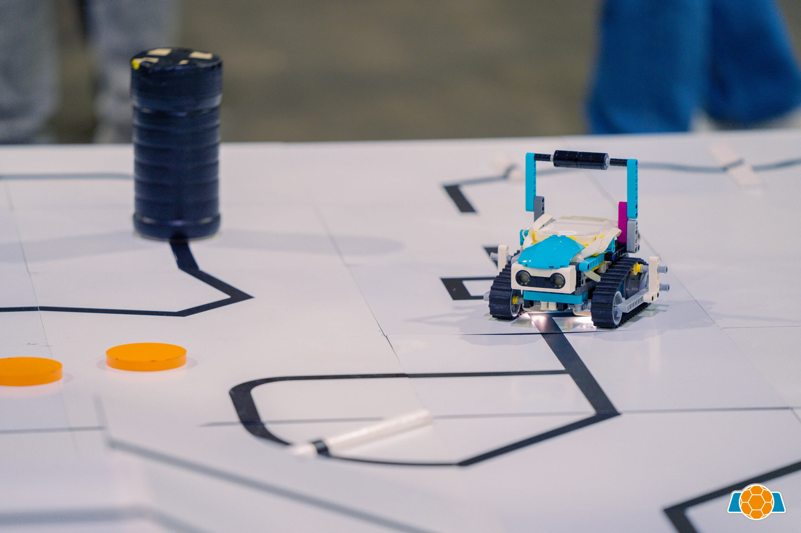
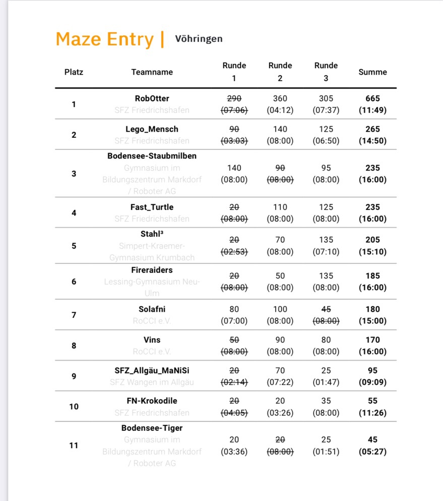

# Robocup 2024

We (Suvin & Gyuvin) participate Robocup 2024 Maze Entry. The preparation is done by every weeks in Rocci Club, Vöhringen.

## Links

- [Rocci Club](https://rocci.net/index.php/unterricht)
- [RoboCup Junior 2024](https://junior.robocup.de/rescue/)

## Official Resources

- [RoboCupJunior Official Website](https://junior.robocup.org/)
- [RoboCupJunior Official Forum](https://junior.forum.robocup.org/)
- [RCJ Rescue Community Website](https://rescue.rcj.cloud)

## Rescue Maze Entry Rules 

Maze Entry Rules are easy to understand. It is a maze with no way out and with some obstacles, holes, checkpoints, ramps and victims to rescue. 

- The victim is marked as a red cross and the robot must stand on it for about 5 seconds. These 5 seconds make sure that the robot spoted the victim.
- The checkpoints are there for when the robot gets stuck or goes into a hole. If you find the checkpoint, you don't need to do anything and just go past.
- The holes you must avoid has some rules too. If the robot is more than half of itself in the hole, it has to go back to the checkpoint. The hole is marked as a black spot.
- The obstacles must be avoided or go right over them, so go pass them. They can be long sticks that are thin and spreaded on the ground or speed bumps that must be runned over. Speed bumps are also a long stick that is much bigger and thicker.

## Points in Rescue Maze Entry

- Speed bumps = 10 points
- Ramp going downward = 10 points
- Ramp going upward = 20 points
- Victim found = 10 points
- Checkpoint found = 10 points

The team with the most points comes to first place. 

## Hardware of the robot

The robot can be out of lego or with other kinds of materials. The robot must have atleast these sensors and motors: 

- 2 Motors: There are responsible for the robots to move.
- 2 Ultrasonic Sensor: They are responsible for turning when they see the wall.
- 1 Color Sensor: For detecting the red Victim and the black Hole.

I recommend you to make it about like a cube shaped robot. It is pretty good if you make a sort of walls around your robot so that you make sure that it doesnt bump into any walls and it doesn't really get stuck. So the robot should have 2 Motors on the bottom. 1 Ultrasonic Sensor in the front and 1 on the side and the Color Sensor on the front bottom. 

## Software of the robot

I made it with Gyuvin that we use variables to short the names of the sensors like the Ultrasonic Sensors to Wallsensors and the Color Sensor to Groundsensor. With that we can organize the programm better. We used a new programm for the first time in a club, so a course. The programm we used was the NXC programm for the NXT robot. We made it that it turns until the Wallsensor see the distance of 20 mm after it sees the wall. How I had thought it didnt go so well. And with that we landed in 8th place and not 5th place of 11 teams. So I recommend that if you have a cubed shaped robot, you should better let it turn 90 degrees. It is sometimes better to have a compass sensor but it can get really complex. 

## My Team

My team was called Vins because I and my brother was the only members of the team and since my name is Suvin and his Gyuvin, we thought we take the "Vin" in our team name. And because there was 2 members, we changed it to "Vins".

## Where I learned the programm NXC

I learned NXC from a club for Advanced children that had done other programms like EV3 before. The club is called RoCCi and I went there every Tuesday. It took me 2 to 3 days to learn all the commands. The teachers there tell you how to do it if you ask them when you don't know something. They gave us (me and Gyuvin) a list of commands. It took us long until the programm worked because there were a lot of errors with the computer and the robot. After December there was an extra course for the other teams and my team to work on. We went on the extra course every Saturday and in the end we get to eat pizza. It was very tasty. 

## The Rankings

## Team Picture at Robotcup

