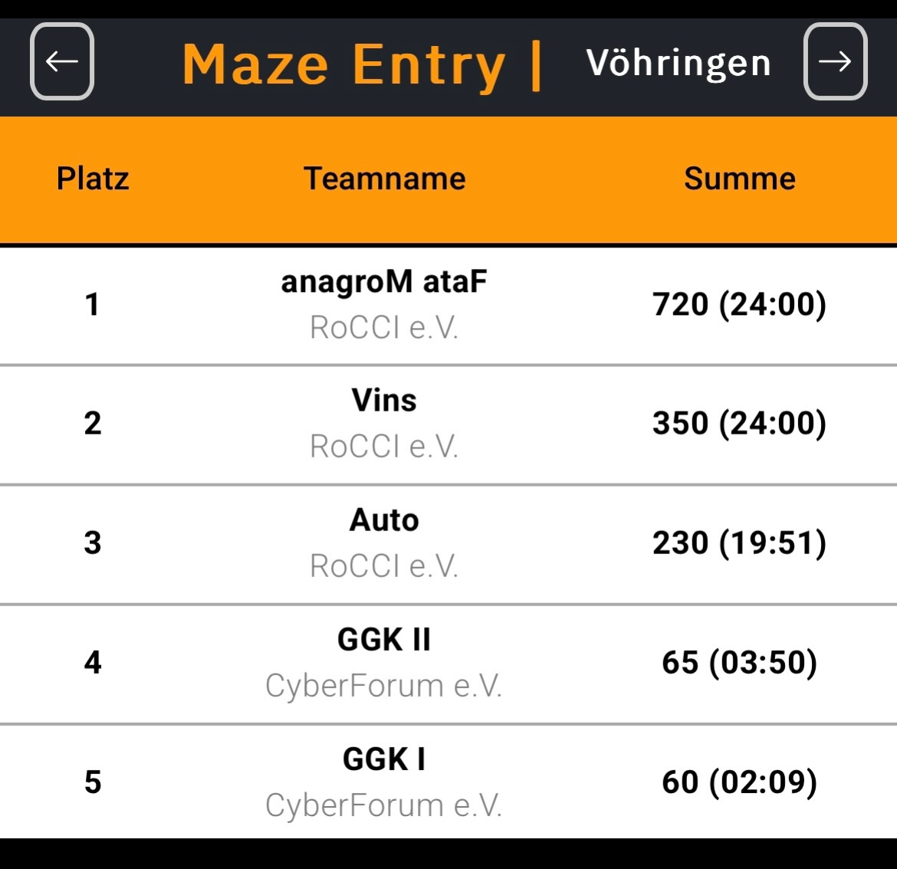
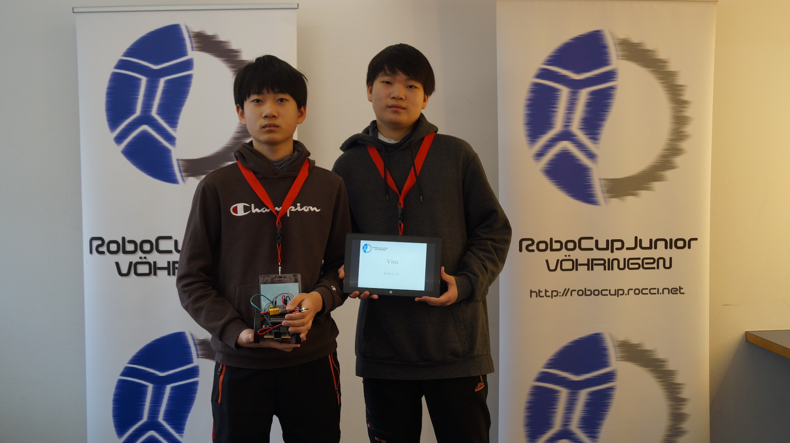
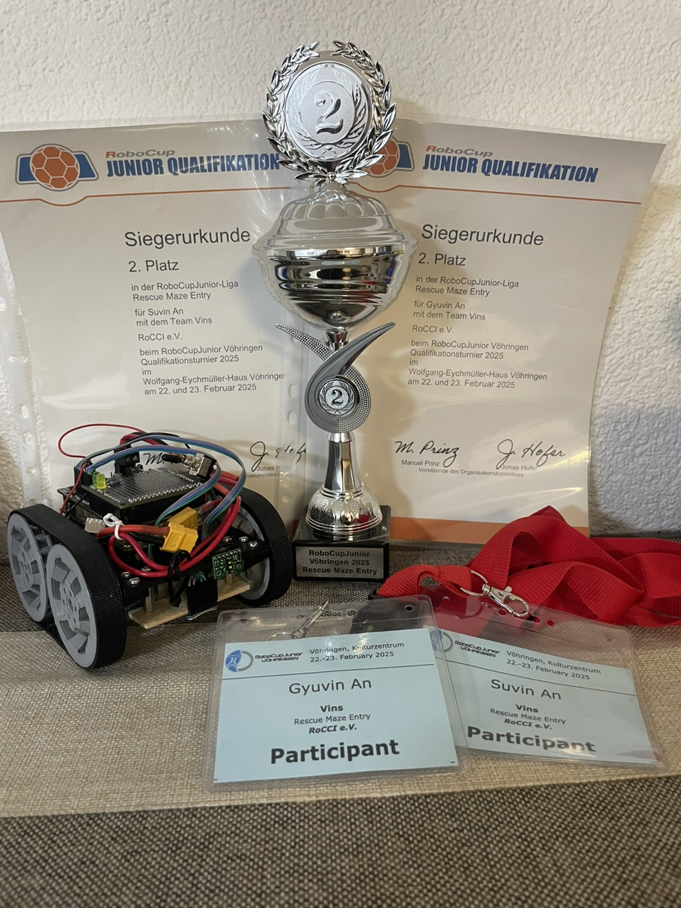

# Robocup 2025

We successfully participated in RoboCupJunior Vöhringen and qualified for the RoboCup German Open 2025 with a 2nd place finish.
The event will take place at Messe Nürnberg from March 13 to March 16, 2025

## Links

- [Rocci Club](https://rocci.net/index.php/unterricht)
- [RoboCup Junior 2025](https://junior.robocup.de/rescue/)

## Official Resources

- [RoboCupJunior Official Website](https://junior.robocup.org/)
- [RoboCupJunior Official Forum](https://junior.forum.robocup.org/)
- [RCJ Rescue Community Website](https://rescue.rcj.cloud)

## Rescue Maze Entry Rules 

Maze Entry Rules are easy to understand. It is a maze with no way out and with some obstacles, holes, checkpoints, ramps and victims to rescue. 

- The victim is marked as a red cross and the robot must stand on it for about 5 seconds. These 5 seconds make sure that the robot spoted the victim.
- The checkpoints are there for when the robot gets stuck or goes into a hole. If you find the checkpoint, you don't need to do anything and just go past.
- The holes you must avoid has some rules too. If the robot is more than half of itself in the hole, it has to go back to the checkpoint. The hole is marked as a black spot.
- The obstacles must be avoided or go right over them, so go pass them. They can be long sticks that are thin and spreaded on the ground or speed bumps that must be runned over. Speed bumps are also a long stick that is much bigger and thicker.

## Points in Rescue Maze Entry

- Speed bumps = 10 points
- Ramp going downward = 10 points
- Ramp going upward = 20 points
- Victim found = 10 points
- Checkpoint found = 10 points

The team with the most points comes to first place. 

## Hardware of the robot

The robot can be out of different materials with 

- 2 Motors: There are responsible for the robots to move.
- 1 Laser Sensor: They are responsible for turning when they see the wall.
- 1 Color Sensor: For detecting the red Victim and the black Hole.

I recommend you to make it about like a cube shaped and a small robot. It is pretty good if you make a sort of walls around your robot so that you make sure that it doesnt bump into any walls and it doesn't really get stuck if it is also small. So the robot should have 2 Motors on the bottom. 1 Laser Sensor in the front and the Color Sensor on the front bottom. 

## Software of the robot

We (Suvin and Gyuvin) programmed in a programm called Arduino. We also made that if the Laser Sensor sees the wall, the robot will turn first 90 degrees to the right. And if there is a wall there, it will turn 180 degrees to the left, if not then it just goes foward and do the same thing again. After it turns 180 degrees left, it checks for a wall again. If there is one, then it turns 90 degrees left and goes back the way it came, if not, then it goes fowards and repeat the whole secuence again. The Color Sensor will be needed to sence the Red Victims and the Black Zones while the turning sequence is happening. 

## My Team

My team was called Vins because I and my brother was the only members of the team and since my name is Suvin and his Gyuvin, we thought we take the "Vin" in our team name. And because there was 2 members, we changed it to "Vins".

## Where I learned the programm Arduino

I learned Arduino from a club for Expert children that had done other programms like EV3 and NXC before. The club is called RoCCi and I went there every Thursday. It took me 2 to 3 days to learn all the commands. The teachers there tell you how to do it if you ask them when you don't know something. They gave us a link to a website with a list of commands. It took us long until the programm worked because there were a lot of errors with the computer and the robot.  

## The Rankings

## Team Picture at Robotcup

## Prizes 

